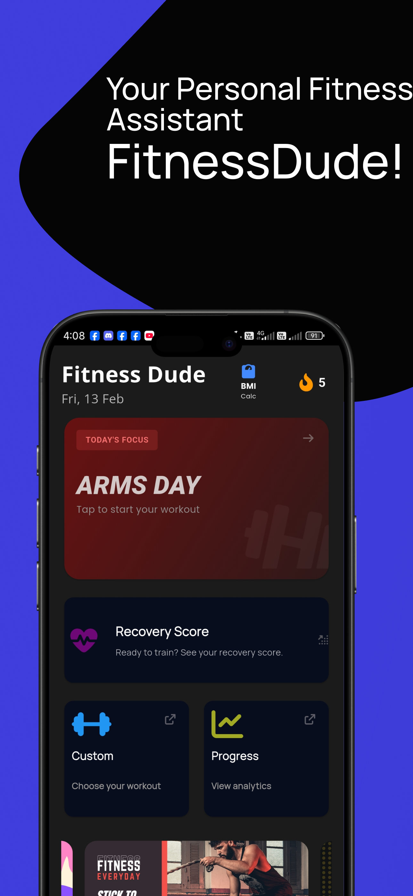
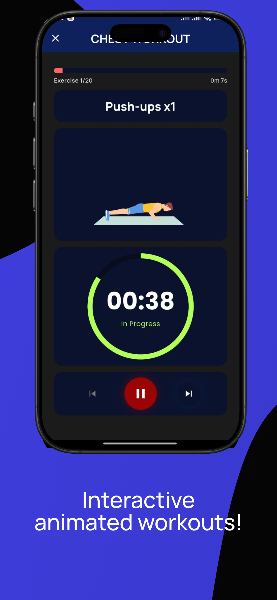
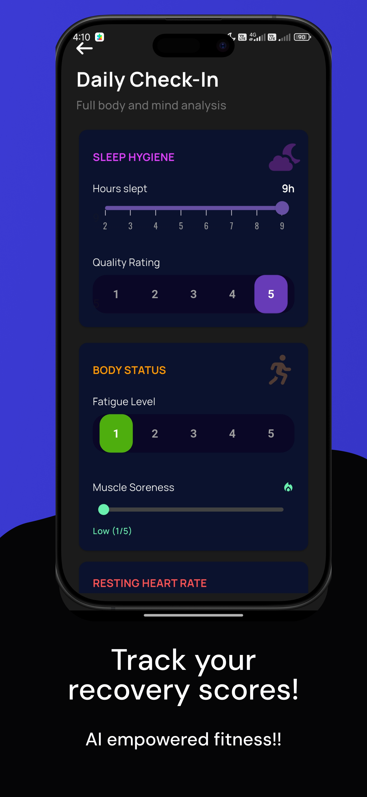
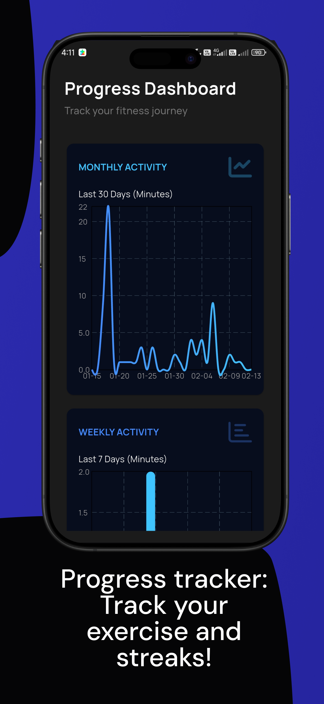
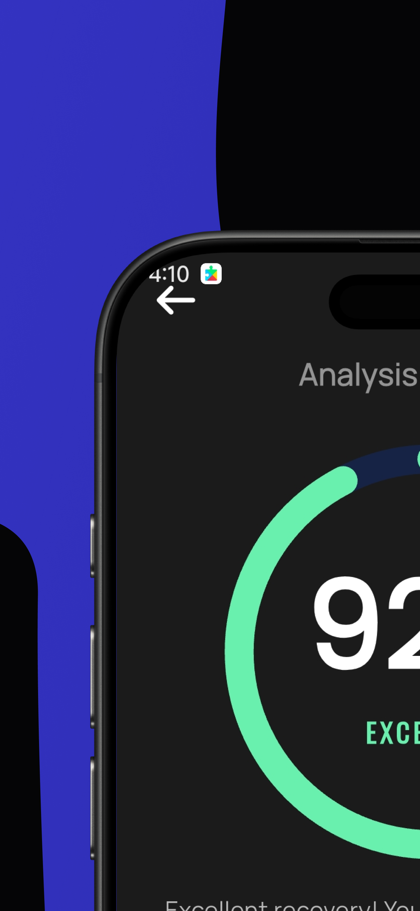
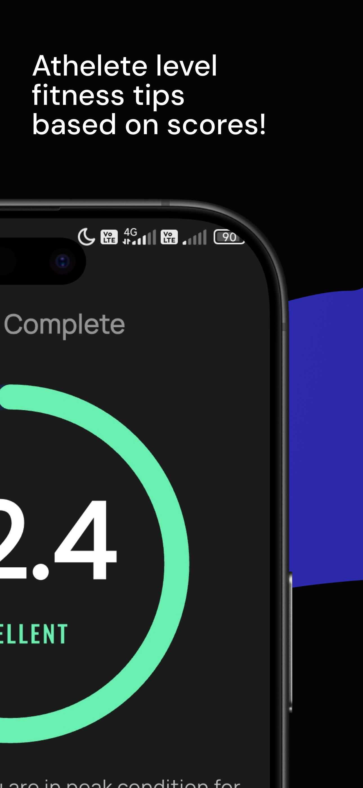
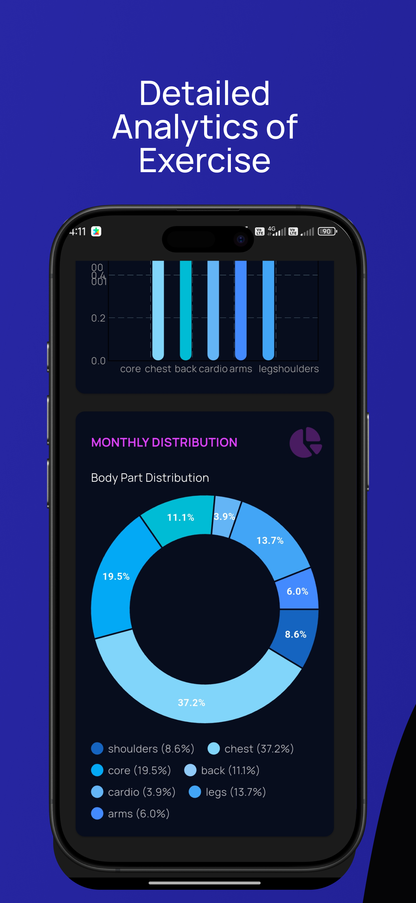
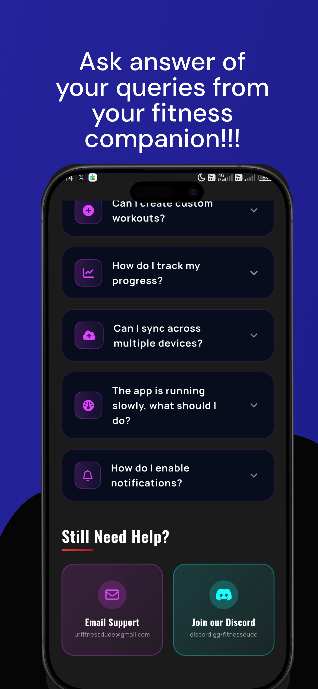
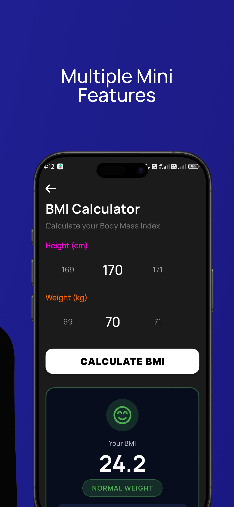

# 💪 FitnessDude


<div align="center">

<!-- Add Logo Here -->

### Your Personal Fitness Companion

Track workouts, monitor progress, stay consistent, and achieve your fitness goals.

[📱 Download on Google Play](https://play.google.com/store/apps/details?id=com.fitnessdude.app) • [⭐ Star on GitHub](https://github.com/urastogi2048/fitnessapp)

</div>

---

## 🚀 Why FitnessDude?

FitnessDude was built to solve a simple problem: staying consistent in the gym.

As a Computer Science student and fitness enthusiast, I wanted to create a real-world application that helps users track workouts, monitor progress, and build better fitness habits.

This project was built using Flutter and NodeJS and represents my journey from learning mobile development to publishing a production app on the Google Play Store.

---

## ✨ Features

### 🏋️ Workout Tracking

* Log exercises, sets, reps, and weights
* Maintain complete workout history
* Track training consistency over time

### 📊 Progress Analytics

* Workout statistics and insights
* Activity heatmaps
* Progress visualization

### 📚 Exercise Library

* Browse exercises by muscle group
* Exercise instructions and descriptions
* Organized workout information

### 🔐 Authentication

* Secure user registration and login
* Personal workout data storage
* Profile management

### 🌙 Modern UI

* Clean and responsive design
* Dark mode support
* Smooth user experience

---

## 📸 Screenshots

<div align="center">

<table>
<tr>
<td></td>
<td></td>
<td></td>
<td></td>
<td></td>
</tr>

<tr>
<td></td>
<td></td>

<td></td>
<td></td>
<td></td>
</tr>
</table>

</div>

---


## 🛠️ Tech Stack

### Frontend

* Flutter
* Dart
* Riverpod

### Backend & Services

* NodeJS
* MongoDB

### Packages

* Lottie
* Shared Preferences
* Flutter Heatmap Calendar
* Flutter Charts

---

## 📂 Project Structure

```text
lib/
├── screens/
├── widgets/
├── models/
├── providers/
├── services/
├── utils/
└── main.dart
```

---

## 🚀 Getting Started

### Prerequisites

* Flutter SDK
* Android Studio or VS Code
* Android Emulator or Physical Device

### Installation

```bash
git clone https://github.com/urastogi2048/fitnessapp.git

cd FitnessDude

flutter pub get

flutter run
```

---

## 🎯 Roadmap

### Upcoming Features

* [ ] Workout Plans
* [ ] Exercise Animations
* [ ] Cloud Backup
* [ ] Nutrition Tracking
* [ ] Social Features
* [ ] AI Workout Recommendations

---

## 🤝 Contributing

Contributions are welcome.

1. Fork the repository
2. Create a feature branch

```bash
git checkout -b feature/new-feature
```

3. Commit your changes

```bash
git commit -m "feat: add new feature"
```

4. Push and create a Pull Request

---

## 👨‍💻 Developer

**Utkarsh Rastogi**

Computer Science Student • Flutter Developer 

Building real-world applications and continuously learning through hands-on projects.

---

## ⭐ Support the Project

If you find FitnessDude useful:

* Star the repository
* Download the app
* Report bugs
* Suggest features
* Share it with friends

Every star, install, and piece of feedback helps improve the project.

---

## 📱 Download

### Google Play Store

👉 **Download FitnessDude:** [(https://play.google.com/store/apps/details?id=com.fitnessdude.app)]

---

<div align="center">

### Built with dedication using Flutter

If you like the project, consider giving it a ⭐

</div>
